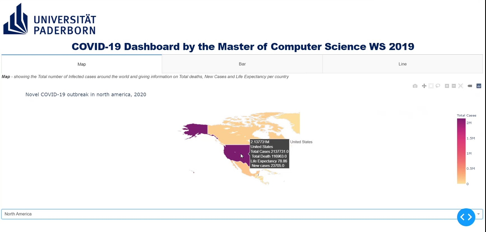
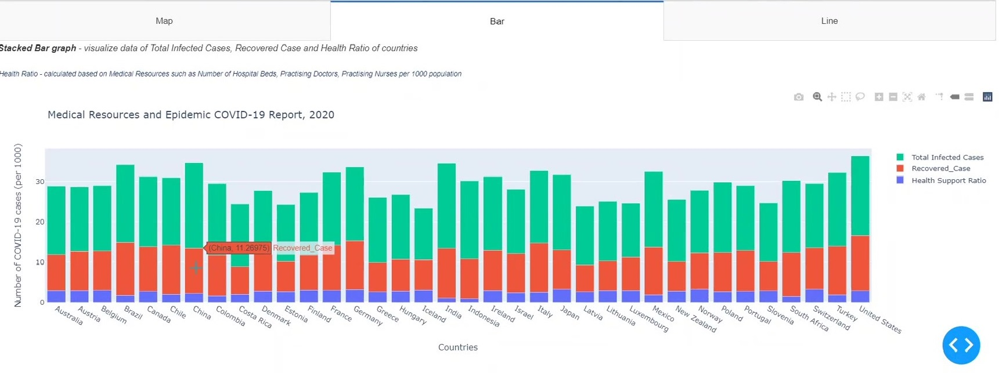
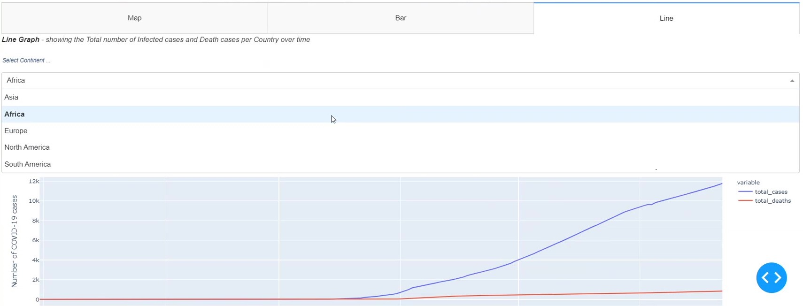

## Interactive Visualization of COVID-19 ##
The aim of this visualization project is to visualize COVID-19 data in such a way that will assist researchers, organizations, such as, Health Services Sector, 
International Labor Organization or normal people to comprehend the impact of
a pandemic situation on current health service and the probable improvement measures that
should be taken by the concerned authority. Besides the specific user group, these visualizations also provide
general information of the pandemic such as, how many infected cases of COVID-19 are there throughout the world, how it has spread with time for 
a specific country etc. 

### Visualization Techniques ### 
Three different tabs are used here to represent three different techniques. By selecting a
specific continent/country from the dropdown menu the user can get same visualized information of that specific continent/country. 
 
* **Geo visualization technique (Choropleth map)** :
The home-screen plots the choropleth map which illustrates total infected cases. Here
color densities are varied with number of cases(qualitative color map). When hovering over the map it will show
the user country-wise information such as, total infected cases, total death cases, life expectancy
and new cases. 

* **Line based technique (Line graph)** :
In this technique the user can get a visualization of total infected COVID-19 cases and death cases as a line
graph. To make the line graph appear on the screen, the user have to select the
continent first from the ‘Continent’ drop down menu and then depending on the selected
continent, countries belonging to that continent can be selected from a child dropdown menu named
‘Country’. The line graph will then illustrate the gradual increase of total infected case and total
death case of that country starting from December 31,2019 to June 17,2020.

* **Region based technique (Stacked Bar graph)** :
Upon clicking on the bar chart tab, the user will get a comparison stacked bar chart
of different countries (in this project 37 countries has been used)  with respective COVID-19 recovered cases, total population and health support
factor. The health support factor is a factor calculated from the total number of hospital beds,
number of doctors and number of nurses of a particular country. It indicates how well a country
can support each citizen with health services. To calculate the factor, first these three values are
calculated for each person by dividing with 1000 as the original data is given for per thousand
people. After that, summation of these three values is taken as a measure to indicate health
support system of a country.

 
### Interaction Operators ###
* Navigation : zoom in , zoom out (Interaction Operand: Screen space)
* Selection (selection by click): (Interaction Operand : Screen space and data value space)
* Reconfiguration (change scaling on axis of bar chart to get a better data point
visualization, switching Excel table columns): ( Interaction Operand : Screen
space)
### Connection operator ###
* Linking (Data for selected countries is plotted on a different view, a line graph)

The project is developed by Vaishnavee Baskaran, Lameya Afroze, Nayela Tasnim Labonno and Indranil Ghosh in Interactive Data Visualization (IDV) course in summer 2020.